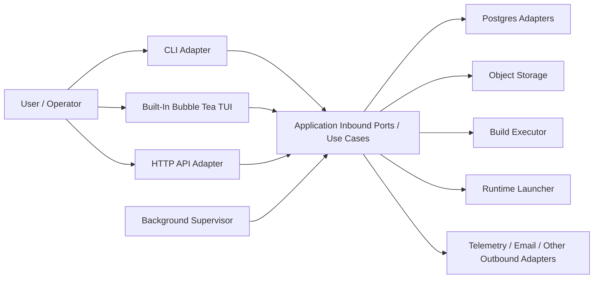

# Architecture

Architectural decisions, patterns, and conventions for the Janus platform.

**What belongs here:** patterns discovered during implementation, architecture decisions, and conventions contributors should follow.

---

## Backend Architecture (Go)

### Module Structure
- Single Go module: `github.com/SMG3zx/janus/services/janus-api`
- Primary backend binary: `janus-api`
- Runtime model: one backend service hosting the HTTP API plus in-process build and deployment workers

### Hexagonal Flow

### Package Layout
- `internal/domain` contains domain rules and types
- `internal/application/ports/inbound` defines the use-case interfaces exposed to driver adapters
- `internal/application/ports/outbound` defines infrastructure contracts required by the application
- `internal/application/usecases` implements inbound ports
- `internal/adapters/inbound/http` hosts the REST API
- `internal/adapters/inbound/cli` hosts bootstrap and non-interactive CLI commands
- `internal/adapters/inbound/tui` hosts the built-in Bubble Tea terminal UI
- `internal/adapters/inbound/background` hosts the in-process worker supervisor
- `internal/adapters/outbound/*` implements Postgres, object storage, build execution, and runtime launch adapters
- `internal/bootstrap` is the single composition root

### Composition Rules
- Driver adapters call inbound ports; they do not bypass the application
- Outbound adapters implement outbound ports and are injected only from `internal/bootstrap`
- The built-in TUI is a first-class inbound adapter and talks directly to application ports when running in-process
- The background supervisor is also an inbound adapter; it schedules and dispatches work, but workflow logic stays in use cases

### API and Workflow Patterns
- Async operation envelope: submit work, then observe operation status and results
- JWT and session-backed auth flows remain application-owned even when the TUI runs in-process
- Structured errors and DTO boundaries belong at the adapter and application edges, not in domain types

### Persistence and Runtime
- PostgreSQL is the system of record for users, projects, builds, deployments, and operations
- MinIO/object storage holds uploaded bundles and produced artifacts
- Wasmer runtime adapters launch deployed workloads
- Build and deployment queue processing happens inside `janus-api`

## Frontend Architecture

### Primary Terminal Interface
- `janus-api tui` launches the built-in Bubble Tea terminal UI
- `janus.ps1 tui` is the recommended local terminal entrypoint
- `frontend/TUI/app-tui` is the legacy external client and is frozen while remaining workflows migrate inward

### Web Interface
- `frontend/web` contains the Next.js web frontend
- The web frontend remains an external driver and talks to Janus only through the HTTP adapter

### Test Console
- `frontend/TUI/test-tui` remains a separate API test console and is not part of the in-process application adapter set

## Key Conventions
- Keep application logic inside inbound use cases, not inside adapters
- Put interfaces at the boundary they belong to
- Prefer direct use-case invocation for in-process adapters instead of routing the app back through its own transport
- Keep `bootstrap` as the only place that knows concrete types from both sides of the hexagon
