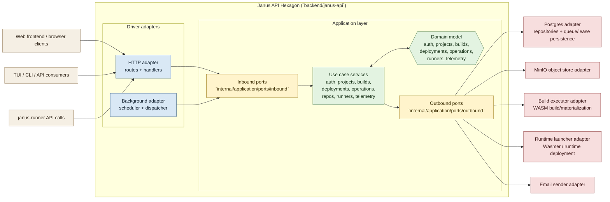

# Janus API Hexagonal Architecture

This document describes `backend/janus-api` in Ports and Adapters terms.

The key rule is simple:

- The hexagon is the application.
- Ports belong to the application.
- Adapters live outside the application.
- The composition root wires concrete adapters to application ports at startup.

Within Janus, that means:

- Driver actors trigger the system through inbound adapters such as HTTP and background scheduling.
- The application layer owns inbound and outbound port interfaces plus use-case orchestration.
- Driven adapters implement infrastructure concerns such as Postgres persistence, object storage, build execution, runtime launching, and email delivery.

## How to read it

1. External actors never call the application directly. They talk to driver adapters.
2. Driver adapters translate technology-specific requests into application port calls.
3. Inbound ports are the application API. They should be named by purpose, not by technology.
4. Use cases execute business workflows using domain rules and outbound ports.
5. Outbound ports are the application SPI. They represent capabilities the application needs from the outside world.
6. Driven adapters implement those outbound ports using concrete tools such as Postgres, MinIO, Wasmer, build executors, and email delivery.
7. The composition root selects which adapters to wire at startup.

## Architectural rules

- Ports belong to the application, not to adapters.
- Ports should be named by intent, not by implementation detail.
  - Good: `Building`, `Deploying`, `SendingNotifications`
  - Bad: `HTTPBuildPort`, `PostgresDeploymentPort`
- The application depends on outbound port interfaces only.
- Driver adapters depend on inbound ports.
- Driven adapters depend on outbound ports.
- The domain should remain free of framework and infrastructure dependencies.
- Adapters may translate transport, persistence, and tool-specific concerns, but they do not own business workflow decisions.
- Background execution is still a driver side concern. A scheduler or worker loop is an inbound adapter when it triggers application work.
- If an adapter needs to talk to infrastructure, it should do so through a driven adapter or outbound port, not by bypassing the application boundary.

## Actors and sides

- Driver actors are the parties that start the conversation.
  - Browser clients
  - TUI/CLI clients
  - Background timers or worker schedulers
- Driven actors are the systems the application calls outward to fulfill work.
  - Postgres
  - Object storage
  - Wasmer runtime launcher
  - Build executor
  - Email infrastructure

The right question for classifying an interaction is: who starts the conversation?

- If the actor starts it, that is a driver-side interaction.
- If the application starts it, that is a driven-side interaction.

## Current code mapping

- Composition root: `backend/janus-api/internal/bootstrap/app.go`
- Inbound ports: `backend/janus-api/internal/application/ports/inbound/ports.go`
- Outbound ports: `backend/janus-api/internal/application/ports/outbound/repositories.go`
- Driver adapters:
  - `backend/janus-api/internal/adapters/inbound/http`
  - `backend/janus-api/internal/adapters/inbound/background`
- Driven adapters:
  - `backend/janus-api/internal/adapters/outbound/postgres`
  - `backend/janus-api/internal/adapters/outbound/objectstore`
  - `backend/janus-api/internal/adapters/outbound/buildexec`
  - `backend/janus-api/internal/adapters/outbound/runtime`
  - `backend/janus-api/internal/email`

## Notes

- The composition root is not part of the application core. Its job is to initialize the environment, choose adapters, instantiate the application, and run driver adapters.
- The background supervisor should stay a dumb driver adapter. It should wake up, invoke inbound ports, and let the application coordinate lease claims, execution, heartbeats, and state transitions through outbound ports.
- The supervisor must not call Postgres, build execution, or runtime adapters directly. Its only job is scheduling and dispatch.
- The Postgres adapter is currently the largest driven adapter. It should continue moving toward smaller repository and queue/lease adapters instead of acting like a mixed workflow engine.
- Reverse proxying, readiness checks, metrics, tracing, cookies, and HTTP auth extraction belong near the HTTP adapter because they are delivery concerns around the hexagon.
- Janus uses feature-oriented use case groupings inside the application. Ports and Adapters does not prescribe the internal structure of the hexagon; it only constrains the boundary and dependency direction.
