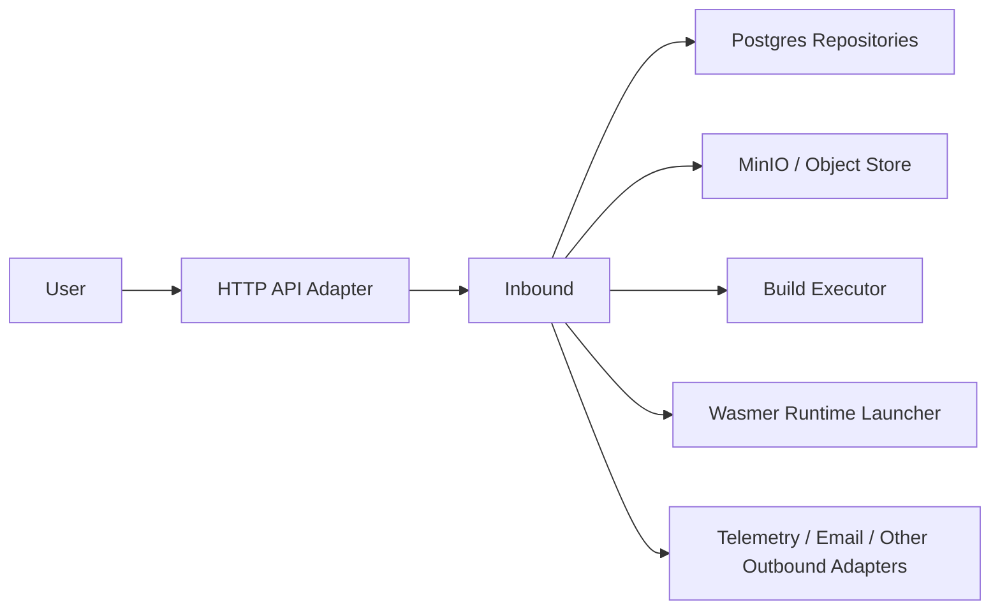

# Janus Handbook

## About This Document

This handbook is the single primary reference for Janus product direction, platform architecture, and implementation guidance.

It consolidates and replaces earlier split documents including vision notes, architecture notes, brainstorming docs, and research reports.

The historical work journal remains separate in `docs/change-log.md` and is intentionally not modified by this consolidation. Earlier source documents are preserved in `docs/archive` for historical reference.

---

## 1. Executive Summary

Janus is a repository-to-runtime platform. Its job is to take application code, transform it into a secure runnable artifact, deploy it to an execution target, expose it through networking and domains, and give users a clean operational surface for builds, deployments, billing, and observability.

The intended user experience is:

1. Create or import a project
2. Connect a source repository or upload a build artifact
3. Build and validate the runtime
4. Deploy with an automatic Janus-managed domain
5. Optionally attach a custom domain
6. Monitor status, logs, performance, and cost over time

Janus is inspired by:

- Vercel and DigitalOcean for frictionless project creation and deployment templates
- ngrok for instant temporary domains plus bring-your-own-domain flows
- Encore for code-first infrastructure generation

The long-term direction is larger than simple hosting: Janus should become a code-to-runtime gateway that can target both self-hosted environments and a distributed compute network.

---

## 2. Implementation Status

This section records the current state of the platform as a working reference. It is updated as milestones are completed.

### 2.1 Functional

- Authentication and MFA flows
- Project creation and management
- GitHub and Git provider integration
- Build pipeline (source import, WASM artifact production)
- Deployment lifecycle (claim, execute, status, logs)
- Valkey-backed worker supervision in the `janus-worker` mode
- Operations model with first-class persistence and status
- Actix-served web UI (control plane, monitoring, build detail, and admin specification)
- SSE-based live log streaming in the UI
- Postgres-backed repositories and workflow state
- MinIO object storage integration
- Wasmer runtime launcher
- Telemetry and observability hooks

### 2.2 In Progress

- Runtime consolidation follow-on work: refine worker health reporting and continue narrowing infrastructure terminology that still reflects the older multi-service model

### 2.3 Planned

- Local runner / reverse tunnel (`--local` flag, QUIC-based edge routing)
- Custom domain binding and TLS provisioning
- Stripe billing integration and usage metering
- Distributed compute marketplace (contributor model, per-minute billing)
- Expanded WASM language support (Python, JS/TS, C#)

---

## 3. Product Vision

### 3.1 Why Janus

Janus is named after the Roman god of beginnings, gates, transitions, time, doorways, and passageways. The product should feel like a gateway between source code and a live running system.

The core promise is:

- minimal friction from code to deployment
- sensible defaults without trapping advanced users
- secure isolation by default
- clear visibility into runtime behavior and cost
- portability across deployment targets

### 3.2 Desired Experience

Janus should make these actions feel simple:

- create a project
- connect a Git provider
- import a repository
- choose or infer a deployment template
- build and deploy quickly
- receive an automatic domain immediately
- later attach a custom domain cleanly

### 3.3 Platform Direction

The target operating model is:

`Repository → Build Artifact → Runtime → Network Endpoint → Managed Service`

That service should be isolated, observable, restartable, domain-addressable, and billable by usage.

### 3.4 Compute Marketplace Direction

Janus is intended to support a distributed execution network that may include cloud-like per-minute billing, a reward or points model for contributed compute resources, and hybrid consumer/provider economics.

This is a strategic direction, not a requirement for every near-term milestone. However, it carries one concrete architectural constraint:

> Lease semantics, execution identity, and billing dimensions must not hardcode single-host assumptions. The worker model and metering layer must remain compatible with multi-provider execution.

---

## 4. Core Platform Model

### 4.1 Main Flow

1. A user writes code or uploads a prepared artifact
2. Janus imports the source
3. Janus determines or receives the build strategy
4. Janus builds a deployable runtime artifact
5. Janus deploys that artifact to a runtime target
6. Janus assigns an automatic domain
7. Janus exposes logs, status, telemetry, and lifecycle controls

### 4.2 Main User Concepts

- **Project**: the top-level unit users manage
- **Build**: an attempt to produce a runnable artifact from source or upload
- **Deployment**: a runtime instantiation of a build
- **Domain**: a routable hostname bound to a deployment
- **Worker**: the Valkey-backed execution subsystem in `janus-worker` mode that performs background work and runtime coordination
- **Operation**: a first-class async workflow that can be observed separately from its result

### 4.3 Resource and Runtime Model

Janus needs to reason about build strategy, runtime compatibility, resource profile estimation, execution mode, and billing dimensions.

The system should be able to answer:

- what can be built
- how it should be run
- what it will cost
- where it should run

### 4.4 Operations Model

Operations are first-class entities in Janus because users observe them directly through build detail pages, log streaming, status polling, and operation history.

An operation is not a transport wrapper around a result. It has its own lifecycle, its own persistence, and its own status/result/failure model.

Operation lifecycle: `pending → running → succeeded | failed`

Operations are related to builds and deployments as observable execution records. A build or deployment may produce one or more operations that users can inspect independently of the outcome. Operations are surfaced in the Actix-served web UI on build detail pages and the monitoring view.

---

## 5. Architecture

### 5.1 Hexagonal Model

Janus uses Ports and Adapters architecture for the backend.

The key rules are:

- the application is the hexagon
- ports belong to the application
- adapters are outside the application
- the composition root wires concrete adapters to application ports at startup

The correct flow is:

```
Actor → Adapter → Port/Hexagon
```

Not:

```
Actor → Port → Adapter → Hexagon
```

Ports are the hexagon boundary. They belong to the application. An actor interacts with the application through an adapter. The adapter is the middleware between the actor and the port, not the port itself.

### 5.2 Driver and Driven Sides

Driver-side actors start the conversation:

- browser clients
- Valkey worker consumers hosted by `janus-worker`

Driven-side actors are called by the application:

- Postgres
- object storage
- build execution backends
- runtime launchers
- email systems
- telemetry sinks

The architecture is symmetric in one way and asymmetric in another:

- **Symmetric**: all adapters, both driver and driven, depend on the application boundary. The application is technology-agnostic in both directions.
- **Asymmetric**: on the driver side, adapters receive a port interface and call it. On the driven side, the application receives driven implementations through injection at startup. The application does not know which driver is driving it, but it does know which driven adapters it is talking to.

### 5.3 Composition Root

The composition root is the only place that should know concrete types on both sides.

For Janus, `cmd/app.go`:

- initializes environment and infrastructure
- chooses which driven adapters implement each outbound port
- creates the application use cases with those adapters injected
- injects those use cases into the HTTP adapter and the Valkey-backed worker mode

No other part of the system performs cross-boundary wiring.

### 5.4 Current Backend Structure

Current high-level adapter flow:



```
internal/
  domain/              # pure types and rules, no I/O
  application/
    ports/
      inbound/         # interfaces the application exposes to drivers
      outbound/        # interfaces the application requires from infrastructure
    usecases/          # application use cases implementing inbound ports
    dto/               # data transfer objects for port boundaries
    errors/            # application error taxonomy
  adapters/
    inbound/
      http/            # HTTP server, routes, handlers, middleware
    outbound/
      postgres/        # Postgres repositories
      objectstore/     # MinIO object storage adapter
      buildexec/       # WASM build executor adapter
      runtime/wasmer/  # Wasmer runtime launcher adapter
  cmd/                 # API, worker, and migration entrypoints and wiring
  email/               # email sender (to be moved to adapters/outbound/email)
```

### 5.5 In-Process Execution Model

Build and deployment execution runs in the `janus-worker` mode through Valkey-backed consumers.

Internal orchestration stays inside the application boundary: HTTP handlers enqueue jobs, and worker consumers call application use cases directly rather than re-entering the backend through HTTP routes.

The worker's job is only to:

- recover unfinished work on startup
- dispatch application work through build and deployment use cases
- respect concurrency limits and cancellation
- integrate with worker readiness and shutdown

It must not:

- talk directly to Postgres
- own workflow logic
- own runtime launch behavior
- make infrastructure-shaped decisions

Application use cases own enqueue, execute, heartbeat, completion, and failure handling. PostgreSQL remains the durable source of truth, while Valkey provides dispatch and recovery of pending stream messages.

### 5.6 Actix Web UI

The Actix-served frontend is a driver adapter in hexagonal terms — it drives the application through HTTP handler ports, the same boundary the REST API uses.

Implementation:

- Embedded HTML/CSS/JavaScript with Actix Web serving and no separate frontend runtime
- TypeScript client code communicating through the HTTP API
- SSE (Server-Sent Events) for live log streaming on build detail pages
- dark-mode-first design system

Design system:

- typography: IBM Plex Mono (code/monospace), Syne (display), DM Sans (body)
- palette: deep navy base with high-contrast accent colors
- layout: card-based with clear hierarchy

Current pages:

- Dashboard: project and deployment overview
- Monitoring: runtime status and health
- Build detail: per-build log streaming, status, artifact info
- Billing: usage and cost display

The frontend communicates with the backend exclusively through the HTTP adapter layer. It has no direct access to the application or domain internals.

## 6. Testing Philosophy

Janus uses a four-stage adapter-combination testing model derived from the hexagonal architecture.

### 6.1 Test Stages

**Stage 1 — Test driver + mock driven (hexagon in isolation)**

The most valuable tests. Use case tests with fake outbound port implementations. No Postgres, no object storage, no Wasmer required. These tests validate that the application behaves correctly regardless of which infrastructure is attached.

**Stage 2 — Real driver + mock driven**

Validate driver adapters (HTTP handlers, supervisor dispatch) against mock inbound ports. Confirm that the adapter translates correctly without testing the application.

**Stage 3 — Test driver + real driven**

Validate outbound adapters (Postgres claim semantics, lease behavior, object store operations) using direct port calls. Confirm infrastructure adapters implement the port contract correctly.

**Stage 4 — Real driver + real driven (end-to-end)**

Full system tests with all real adapters wired. Validate deployment and startup behavior. These are the most expensive and run least frequently.

### 6.2 Rules

- Use-case tests must not require Postgres, object storage, or Wasmer
- Worker supervisor tests must use mock inbound ports only
- Postgres adapter tests validate queue semantics independently of workflow orchestration
- Lost-lease tests are mandatory for worker use cases: heartbeat fails, context cancels, no normal completion is written

### 6.3 Worker Error Taxonomy

The worker execution path uses a typed error taxonomy defined in `internal/application/errors`. Adapters return raw errors. Use cases map them to:

- `ErrNoWorkAvailable` — no claimable work; normal idle cycle
- `ErrLeaseLost` — lease expired or taken; do not write completion
- `ErrRetryableExecution` — transient failure; work may be re-claimed
- `ErrPermanentExecution` — unrecoverable failure; mark build/deployment failed
- `ErrInfrastructureUnavailable` — infrastructure unreachable; log and back off

---

## 7. Build and Runtime Strategy

### 7.1 Why WASM

Janus is moving toward a WASM-first runtime model because it provides:

- stronger isolation than direct host execution
- a cleaner artifact boundary
- better portability across environments
- a path to language-agnostic build pipelines

### 7.2 Current Runtime Direction

- build source into a WASM artifact
- run it under the configured WASM runtime from `janus-api`
- use HTTP component support where available
- use command-style compatibility modes when needed

### 7.3 Language Support Strategy

**High-value foundational support:**

- Rust
- Go / TinyGo
- C/C++

**Component-model expansion:**

- Python via `componentize-py`
- JavaScript/TypeScript via `jco`
- C#/.NET via `componentize-dotnet`

Long-tail or experimental support follows once the build pipeline is stable.

### 7.4 Key WASM Decisions

- Standard Go works but TinyGo gives a stronger path for smaller WASI Preview 2 artifacts
- Rust remains the strongest first-class language for WASI and component-model support
- Component-model languages are treated as explicit build-tool integrations, not guessed at runtime
- Janus should prioritize build container/toolchain isolation rather than assuming host-installed toolchains permanently

---

## 8. Domains and Networking

### 8.1 Platform Subdomains

The recommended strategy for Janus-managed subdomains is wildcard DNS.

Why:

- no per-deployment DNS propagation wait
- no DNS API call per deployment
- immediate preview-style URLs

Shape: one wildcard record for Janus-managed app subdomains; routing handled at the proxy layer.

### 8.2 Custom Domains

1. User requests domain binding
2. Janus generates verification instructions
3. User creates DNS records
4. Janus verifies ownership
5. TLS/certificate provisioning completes
6. Traffic begins routing to the deployment

This follows the same mental model users expect from Vercel and Netlify.

### 8.3 Local Runner / Reverse Tunnel

Janus will support a `--local` flag that allows users to run an application locally and expose it through the Janus edge, eliminating the need to deploy to a remote runtime target during development.

Architecture direction:

- a local app-runner process establishes an outbound encrypted tunnel to the Janus edge
- Janus routes inbound traffic for the deployment's domain through that tunnel to the local process
- the conceptual model is Cloudflare's `cloudflared` / ngrok — the local process initiates, the edge routes
- the tunnel implementation direction is QUIC-based, potentially over WireGuard

This feature does not change the core deployment model. The local runner is just another execution target from the perspective of the domain and networking layers. The worker identity and liveness model is designed to accommodate it without special-casing.

### 8.4 Cloudflare Direction

Cloudflare is the recommended fit for:

- DNS record management
- wildcard platform subdomains
- custom hostname flows with ownership verification
- future SaaS-domain support

---

## 9. Billing and Metering

### 9.1 Billing Model

Usage-based metering through Stripe.

Primary billable dimensions:

- CPU time
- RAM time
- disk usage
- network egress

These dimensions are chosen to be compatible with both single-provider and multi-provider execution models.

### 9.2 Stripe Direction

- one customer per Janus customer
- one subscription with multiple metered items
- periodic usage reporting via meter events
- monthly billing by default

This gives Janus a straightforward pay-as-you-go model with room for credits, volume pricing, or hybrid pricing later.

### 9.3 Marketplace Billing

The standard Stripe metering model covers the near-term single-provider case. Per-minute billing and the contributor rewards model for the distributed execution network are deferred until that layer is closer to implementation.

The metering dimensions above are deliberately chosen to extend to multi-provider billing without structural changes. When the marketplace layer arrives, Janus should be able to report per-runner usage against the same dimensions with provider attribution added.

### 9.4 Pricing Strategy

- cost-informed and transparent
- adaptable by environment or market
- Stripe metering is infrastructure for pricing, not the source of pricing strategy

---

## 10. Near-Term Product Target

The immediate target is a developer being able to:

- connect GitHub
- import a repository
- build a WASM artifact
- inspect build logs and status in the Actix web UI
- deploy to a controlled runtime target
- receive an automatic Janus-managed domain
- optionally bind a custom domain
